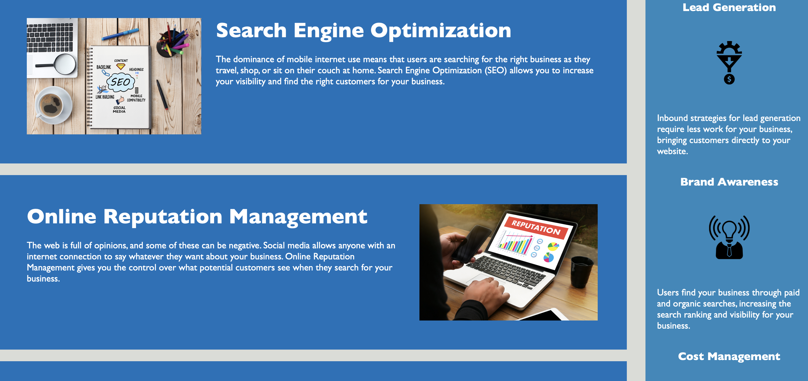
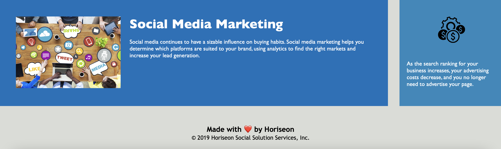

# Semantic Challenge One

## Purpose
A website that follows accessibility standards.

## Built With
* HTML
* CSS

## Website
https://jsun994.github.io/semantic/

## Description
Added semantic HTML elements that follow a logical structure.
Added alt attributes to images.
Fixed sequential order of heading of footer.
Added a concise & descriptive title.
Added comments in HTML & CSS.
Organized & consolidated CSS codes.

